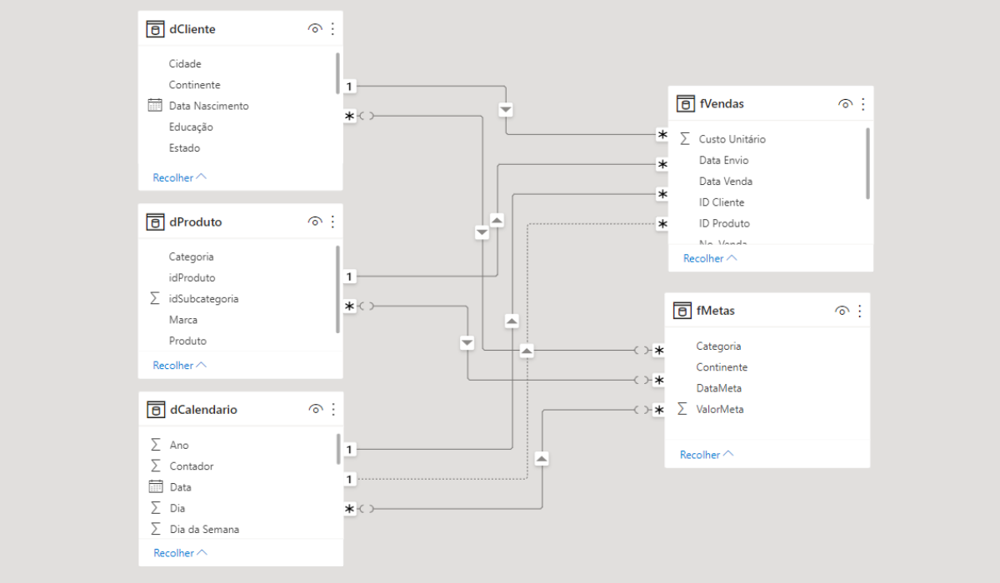
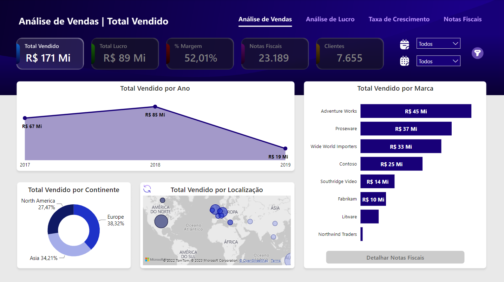
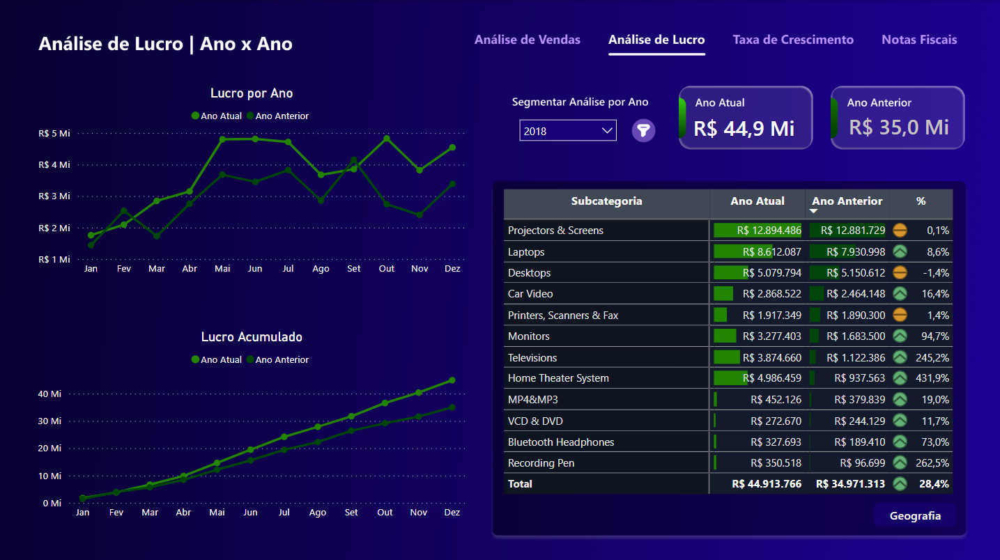
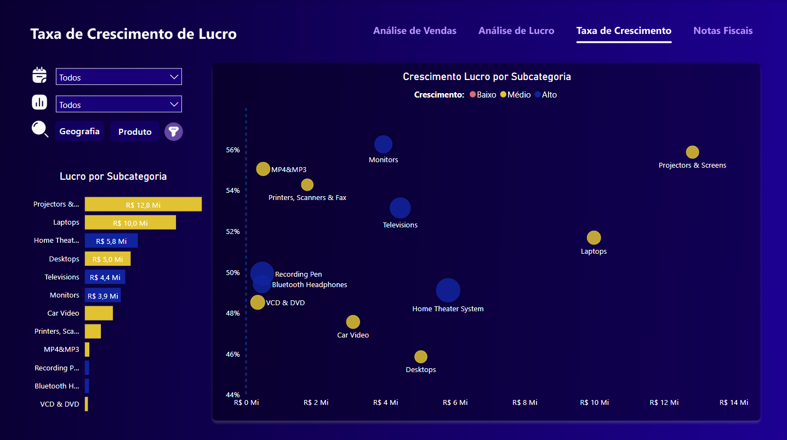
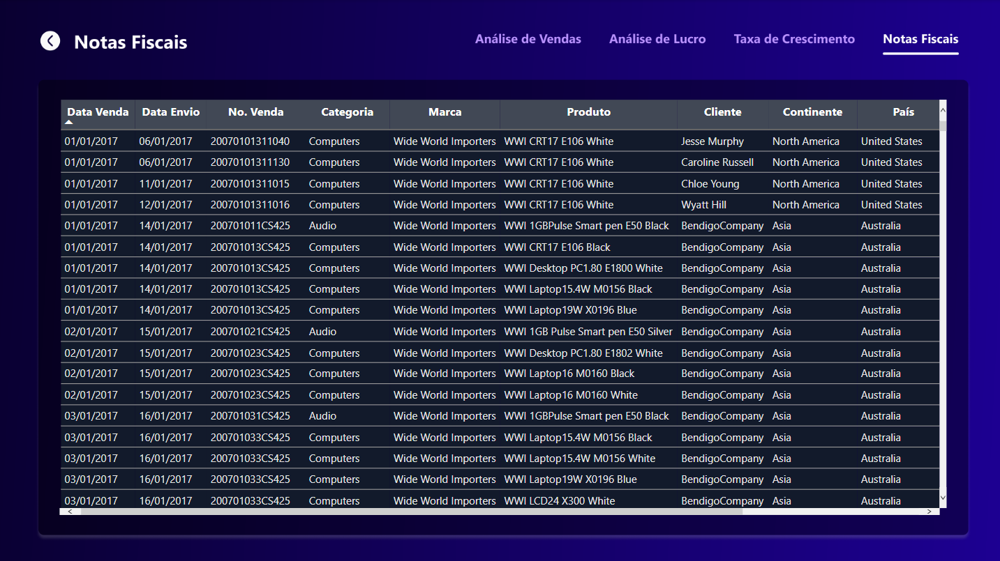

Esse é um projeto de Business Intelligence.

Os conjuntos de dados utilizados estão disponíveis no repositório "Bases".

Para visualizar e interagir com o dashboard completo acesse [este link](https://rafaelgfelippe.github.io/portfolio-details.html). 

# Entendimento do Negócio

A Master Eletronics é uma empresa americana que comercializa produtos eletrônicos de forma online para todo o mundo. Apesar de sua rápida expansão, atualmente a empresa não conta com uma equipe especializada em análise de dados. 

Visando mudar esse cenário e se tornar uma empresa data driven, fomos contratados para desenvolver um dashboard que retrate de forma descritiva o desempenho das vendas nos últimos anos. O dashboard deverá conter informações referentes as marcas e produtos mais vendidos, assim como uma análise temporal que demonstre de forma visual o comparativo anual de vendas. 

# Entendimento dos Dados

Os dados disponibilizados pela Master Eletronics são referentes ao anos de 2017, 2018 e início de 2019. Os arquivos foram extraídos de diversas fontes e por isso estão em diferentes formatos como CSV, Excel e JSON. 

- **Vendas:** tabela com informações históricas das vendas entre 01/01/2017 a 16/03/2019.  
- **Meta 2017:** metas de vendas do ano de 2017 para cada continente e categoria de produto.  
- **Meta 2018 e 2019:** metas de vendas do ano de 2018 e 2019 para cada continente e categoria de produto.  
- **Clientes:** tabela com informações cadastrais dos clientes.  
- **Localizacao:** tabela com informações sobre as localidades das vendas (cidades, países e continentes).  
- **Produtos:** tabela com informações sobre as marcas e produtos.  
- **Subcategoria:** informações complementares dos produtos vendidos pela empresa.  

# Estratégia da Solução

Como estratégia para a solução do projeto, definimos as seguintes etapas:

- **1. Entendimento do Negócio:** nesta etapa inicial, o principal objetivo é compreender o problema de negócio e as necessidades do cliente.

- **2. Entendimento dos Dados:** aqui, nosso objetivo é realizar a limpeza e a transformação nos dados disponibilizados pela empresa. 

- **3. Modelagem dos Dados:** essa é a etapa em que desenvolvemos o modelo de dados, definindo os relacionamentos entre as tabelas fatos e dimensões.

- **4. Desenvolvimento do Dashboard:** é aqui que iremos desenvolver todas as funcionalidades do painel, definindo juntamente ao cliente quais os principais KPI's e visuais que deverão estar destacados no painel. 

- **5. Personalização do Layout:** após a criação dos visuais, é hora de cuidar da parte visual do projeto. Utilizando uma ferramenta externa, criaremos os background's das páginas do dashboard.

- **6. Testes de Funcionalidades:** antes da entrega final do projeto ao cliente, testaremos todas as funcionalidades disponivéis no dashboard.

# Modelagem dos Dados

Durante a limpeza e transformação dos dados, várias tarefas foram aplicadas utilizando o Power Query em conjunto com as linguagens DAX e M. Além dessa etapa ser fundamental para tratar possíveis inconsistências nos dados, ela também nos permitiu criar uma modelagem eficiênte através do modelo Star Schema. 

# Desenvolvimento do Dashboard

O desenvolvimento do dashboard constitui na criação de quatro principais visões: 

**Análise de Vendas:** visão que possibilita analisar diferentes métricas por marca do produto, localização e ao longo dos meses. Essas métricas incluem o total vendido, lucro obtido, margem percentual, entre outras.

 
 

**Análise de Lucro:** visão mais detalhada do lucro obtido pela empresa. Nessa visão, temos uma análise mensal e acumulada do lucro da empresa ao longo dos meses. Além disso, uma tabela complementa a análise comparando a variação anual das categorias ou localizações. 

 
 

**Taxa de Crescimento:** visão que classifica o crescimento percentual de vendas de um produto ou localização de acordo com três classes: baixo, médio e alto.

 
 

**Notas Fiscais:** visão com todas as informações referentes as notas fiscais emitidas pela empresa. 

# Conclusões Finais

Nosso principal objetivo nesse projeto foi disponibilizar ao cliente uma análise descritiva da performance de vendas de sua empresa. Para esse fim, escolhemos o Power BI como nossa principal ferramenta de trabalho. Utilizando os recursos do próprio Power BI, realizamos toda a etapa de limpeza e transformação, além da modelagem dos dados. 

Outra etapa de extrema importância no projeto foi o desenvolvimento de toda a parte visual do dashboard. Para essa tarefa, utilizamos o Figma, uma das ferramentas mais utilizadas atualmente. 

# Autor

Rafael Felippe  

